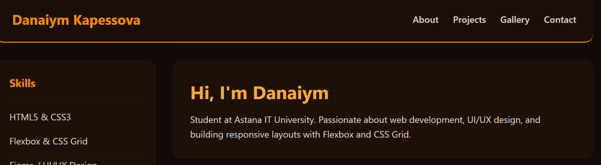
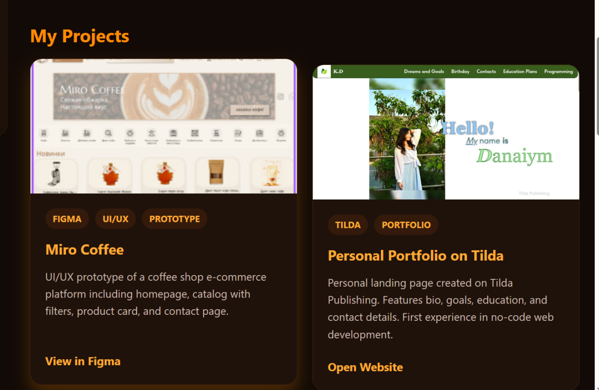
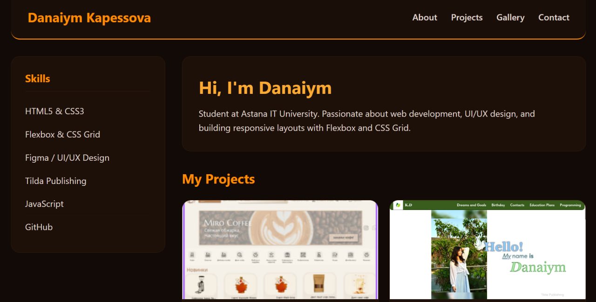
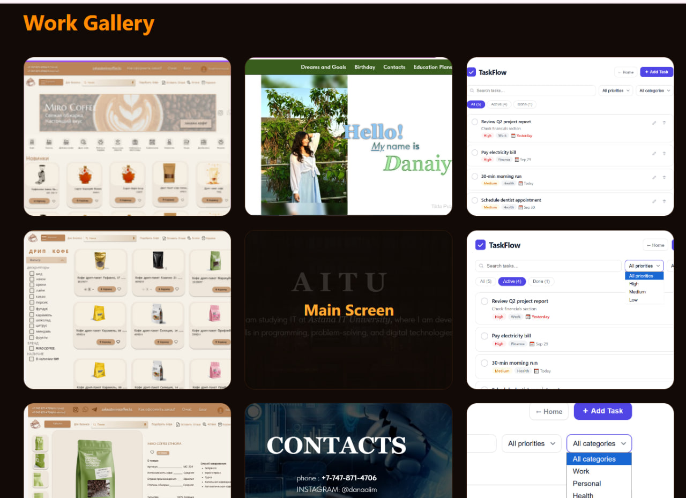
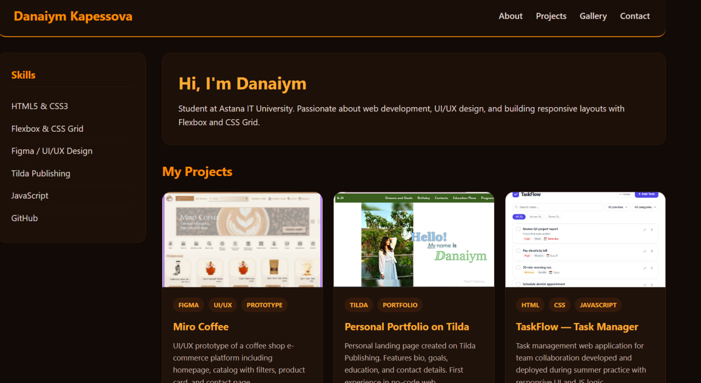

# Assignment 2 - Advanced CSS (Flexbox & Grid)

Student: Kapessova Danaiym
Group: IT-2513

## Description
This repository contains my second assignment for Web Technologies course. The main goal was to build a responsive portfolio page using Flexbox and CSS Grid without using external frameworks.

## Tasks Overview

### Task 0. Navigation Bar
I created a header with a logo and navigation links. Applied Flexbox to align elements horizontally and keep them centered vertically.

### Task 1. Card Row
Created three project cards featuring my actual work. Used Flexbox to place them in a row, ensured equal heights for all cards, and added hover effects.

### Task 2. Page Layout with Grid Areas
Structured the main layout using CSS Grid areas. Assigned specific grid areas for header, main content, sidebar, and footer.

### Task 3. Image Gallery
Built a 3-column gallery using CSS Grid containing 9 image cards with hover captions overlay.

### Task 4. Portfolio Page
Combined Flexbox and CSS Grid together in a full portfolio page. Flexbox handles navbar and project cards, while Grid controls the outer layout and gallery.

## Process Summary
I started by reviewing the lecture slides and practicing layout properties in Flexbox Froggy and Grid Garden games. After that, I structured my index.html file with semantic tags and added styles in style.css step by step.